# Deep equilibrium models for video snapshot compressive imaging (AAAI'2023)

In this repository we provide code of the paper:
> **Deep equilibrium models for video snapshot compressive imaging**

> Yaping Zhao, Siming Zheng, Xin Yuan

> arxiv link: https://arxiv.org/abs/2201.06931

# Highlights
- [paper](https://arxiv.org/abs/2201.06931) | [code](https://github.com/IndigoPurple/DEQSCI) | [Mathematical Cookbook](https://arxiv.org/abs/2202.07437)
- reported in Chinese by [QbitAI](https://mp.weixin.qq.com/s/Rp6wq2ytMZztTuRrsT7AiA), [IntelligentOptics](https://mp.weixin.qq.com/s/9I6asxM1ZO5a2qDLyuCDRg)  
- video presentation on [YouTube](https://www.youtube.com/watch?v=Pc2qaE_3unU&list=PLELW-PRf7MIftVUV0NLqR1s7iEdewbujN), Bilibili ([English](https://www.bilibili.com/video/BV1X54y1g7D9/), [Chinese](https://www.bilibili.com/video/BV1V54y137QK/), [Cantonese](https://www.bilibili.com/video/BV1224y1G7ee/))

# Results
 Compressed Measurement |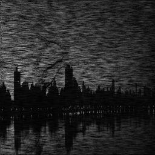|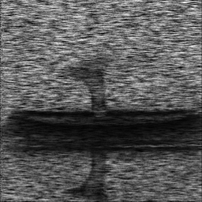|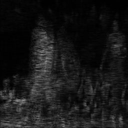
--- | ------ | ------ | ------ 
 Our Reconstruction Result |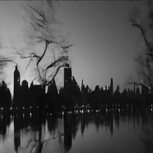|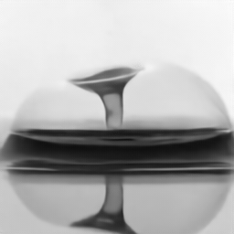|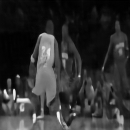

Compressed Measurement ||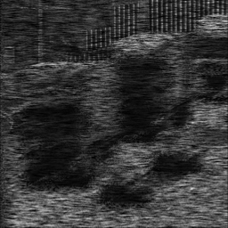|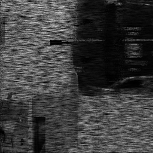
--- | ------ | ------ | ------ 
 Our Reconstruction Result |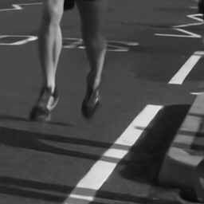|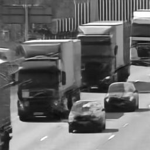|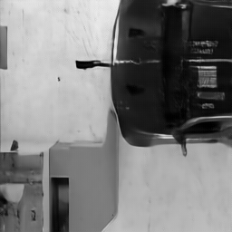

[//]: # ( Compressed Measurement | Our Reconstruction Result)
[//]: # ( ----- | ------)
[//]: # (![Measurement]&#40;img/measurement_1.png "Compressed Measurement"&#41;|![Ours]&#40;img/Aerial.gif "Our Reconstruction Result"&#41;)

[//]: # (![Measurement]&#40;img/measurement_2.png "Compressed Measurement"&#41;|![Ours]&#40;img/Drop.gif "Our Reconstruction Result"&#41;)

[//]: # (![Measurement]&#40;img/measurement_3.png "Compressed Measurement"&#41;|![Ours]&#40;img/Kobe.gif "Our Reconstruction Result"&#41;)

[//]: # (![Measurement]&#40;img/measurement_4.png "Compressed Measurement"&#41;|![Ours]&#40;img/Runner.gif "Our Reconstruction Result"&#41;)

[//]: # (![Measurement]&#40;img/measurement_5.png "Compressed Measurement"&#41;|![Ours]&#40;img/Traffic.gif "Our Reconstruction Result"&#41;)

[//]: # (![Measurement]&#40;img/measurement_6.png "Compressed Measurement"&#41;|![Ours]&#40;img/Vehicle.gif "Our Reconstruction Result"&#41;)

# Requirements
For pre-requisites, run:
```
conda env create -f environment.yml
conda activate deq
```

# Pre-trained models
Pre-trained models are provided in the `models` folder, and testing datasets in the `data/test_gray/` folder.

Therefore, <span style="color:red">**you can quickly get started without additional downloads required**</span>.

# Getting started
To reproduce the main results from our paper, simply run:

```
sh test_ffdnet.sh
```
or
```
python ./video_sci_proxgrad.py --savepath ./save/test_ffdnet/ --testpath ../data/test_gray/ --loadpath ./models/ffdnet.ckpt --denoiser ffdnet --and_maxiters 180 --inference True
```

# Testing other models
Pretrained *DE-GAP-CNN* and *DE-GAP-RSN-CNN* are also provided in the `models` folder. For testing those models, sun:
```
sh test_cnn.sh
```
or
```
sh test_rsn_cnn.sh
```

# Training dataset
The training dataset is available at [OneDrive](https://connecthkuhk-my.sharepoint.com/:u:/g/personal/zhaoyp_connect_hku_hk/Ec0mdw6NSlBDmnm5sJvhu9UBq8ZPxhy2uvPIv2UWrkPoXQ?e=DL5ruv) 
and [Baidu Netdisk](https://pan.baidu.com/s/1OopJrOqZBb3yqJWvaCIRPA) (password: df8a). Download and unzip the file into 
the folder `data/DAVIS/matlab/`, of which the file structure should be:
- DAVIS/
    - matlab/
        - gt/
        - measurement/
        - data_generation.m
        - mask.mat

# Training new models
For training *DE-GAP-FFDnet* from scratch, you could simply run:
```
sh train_ffdnet.sh
```
or
```
python ./video_sci_proxgrad.py \
--savepath ./save/train_ffdnet/ \
--trainpath ../data/DAVIS/matlab/ \
--testpath ../data/test_gray/ \
--denoiser ffdnet
```

If you want to try different settings, you could find, use and add the arguments in the [video_sci_proxgrad.py](video_sci_proxgrad.py).

For example, you may run:
```
python ./video_sci_proxgrad.py \
--batch_size 1 \
--lr 0.0001 \
--lr_gamma 0.1 \
--sched_step 10 \
--print_every_n_steps 100 \
--save_every_n_steps 1000 \
--savepath ./save/train_ffdnet/ \
--trainpath ./data/DAVIS/matlab/ \
--testpath ./data/test_gray/ \
--loadpath ./save/ffdnet.ckpt \
--denoiser ffdnet \
--gpu_ids 0
```

# Citation
Cite our paper if you find it interesting!
```
@article{zhao2022deep,
  title={Deep equilibrium models for video snapshot compressive imaging},
  author={Zhao, Yaping and Zheng, Siming and Yuan, Xin},
  journal={arXiv preprint arXiv:2201.06931},
  year={2022}
}

@article{zhao2022mathematical,
  title={Mathematical Cookbook for Snapshot Compressive Imaging},
  author={Zhao, Yaping},
  journal={arXiv preprint arXiv:2202.07437},
  year={2022}
}
```
