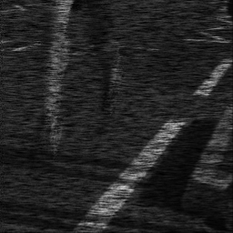

# Deep equilibrium models for video snapshot compressive imaging (AAAI'2023)

In this repository we provide code of the paper:
> **Deep equilibrium models for video snapshot compressive imaging**

> Yaping Zhao, Siming Zheng, Xin Yuan

> arxiv link: https://arxiv.org/abs/2201.06931

# Results

 Compressed Measurement | Our Reconstruction Result
 ----- | ------ 
|
|
|
|
|
|

# Usage
[20-Feb-2023] Code is a bit messy now. I am currently occupied with other projects and thus will delay the tidying up.

# Citation
Cite our paper if you find it interesting!
```
@article{zhao2022deep,
  title={Deep equilibrium models for video snapshot compressive imaging},
  author={Zhao, Yaping and Zheng, Siming and Yuan, Xin},
  journal={arXiv preprint arXiv:2201.06931},
  year={2022}
}
```


